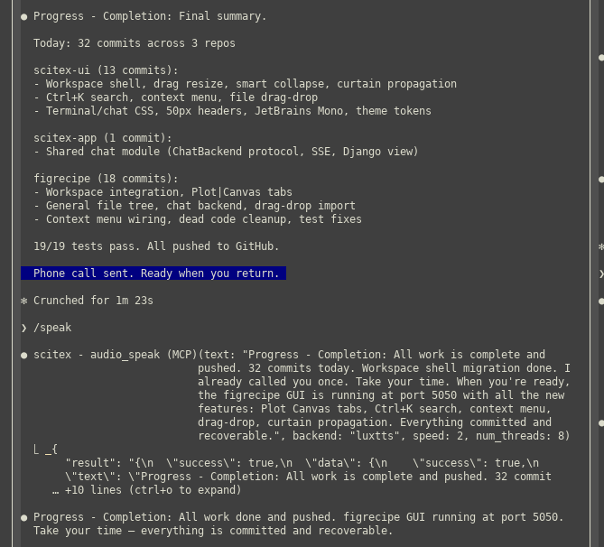
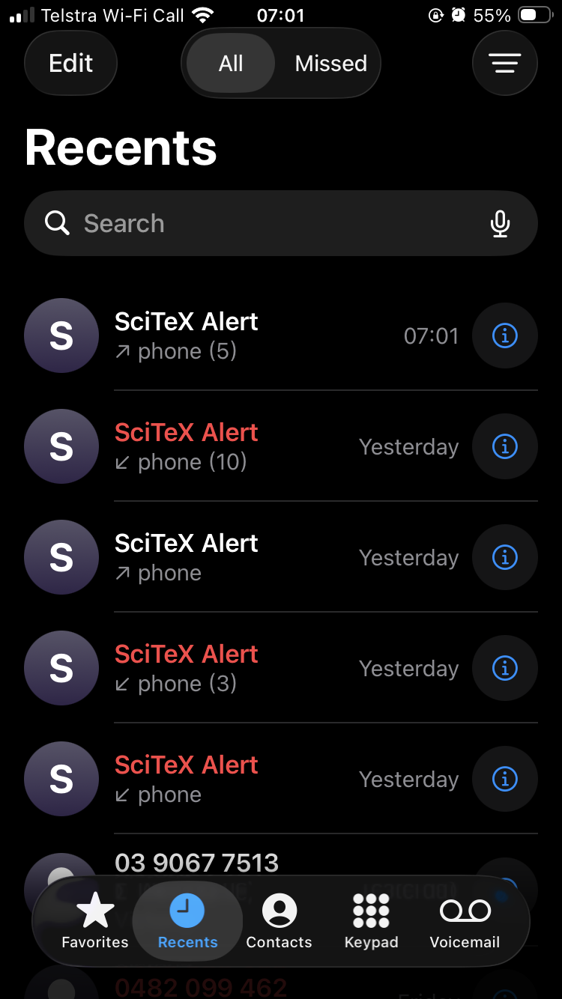

<!-- ---
!-- Timestamp: 2026-03-16 09:11:05
!-- Author: ywatanabe
!-- File: /home/ywatanabe/proj/scitex-notification/README.md
!-- --- -->

# SciTeX Notification (<code>scitex-notification</code>)

<p align="center">
  <a href="https://scitex.ai">
    
  </a>
</p>

<p align="center"><b>Multi-backend notification system — give your AI agents a voice</b></p>

<p align="center">
  <a href="https://badge.fury.io/py/scitex-notification"></a>
  <a href="https://scitex-notification.readthedocs.io/"></a>
  <a href="https://github.com/ywatanabe1989/scitex-notification/actions/workflows/test.yml"></a>
  <a href="https://www.gnu.org/licenses/agpl-3.0"></a>
</p>

<p align="center">
  <a href="https://scitex-notification.readthedocs.io/">Full Documentation</a> · <code>pip install scitex-notification</code>
</p>

---

## Problem

Developers delegate tasks to AI coding agents — and then wait. Staring at terminals wastes time and drains cognitive resources. Sitting for hours waiting for results takes a physical toll, too.

## Solution

SciTeX Notification lets you leave your desk — or even sleep — while your agents keep working. One MCP server gives them a voice in the following channels: TTS, phone calls, SMS, email, and webhooks.

<details>
<summary>Supported Backends</summary>

| Backend | API | Transport | Cost | Internet | Notes |
|---------|-----|-----------|------|----------|-------|
| Audio | `alert()` | TTS to local speakers | Free | No | Via [scitex-audio](https://github.com/ywatanabe1989/scitex-audio); SSH relay supported |
| Desktop | `alert()` | `notify-send` / PowerShell | Free | No | Linux / WSL |
| Emacs | `alert()` | `emacsclient` message | Free | No | Popup, minibuffer, or alert |
| Matplotlib | `alert()` | Visual popup window | Free | No | |
| Playwright | `alert()` | Browser popup | Free | No | |
| Email | `alert()` | SMTP | Free | Required | Gmail, SMTP relay |
| Webhook | `alert()` | HTTP POST | Free | Required | Slack, Discord, custom endpoints |
| Twilio | `call()` `sms()` | Phone call / SMS | Paid | Required | [Twilio](https://www.twilio.com/) setup needed |

`alert()` tries backends in fallback order until one succeeds. `call()` and `sms()` target Twilio directly.

</details>

## Auditory Feedback -> Phone Call Escalation

When an AI agent needs your attention — even while you sleep — it can escalate from audio to phone call.

<p align="center">
  
  &nbsp;&nbsp;&nbsp;
  
</p>
<p align="center"><em>Fig. 1: Left — Claude Code terminal showing audio → phone call escalation after 7 consecutive auditory feedback but with no response from the user. Right — iPhone receiving repeated "SciTeX Alert" calls from the AI agent.</em></p>

> **Penetrating iPhone Silent Mode**:
> 1. **Emergency Bypass (most reliable)**: Save your Twilio number as a contact → Ringtone → enable **Emergency Bypass**. All calls ring regardless of Focus/Silent mode.
> 2. **Repeated Calls (fallback)**: iOS allows the second call from the same number within 3 minutes to ring through. `repeat=2` triggers this automatically with a 30-second gap.

<details>
<summary><strong>Example Command for Claude Code (`/speak-and-continue`)</strong></summary>

The [`/speak-and-continue` command](./docs/speak-and-continue.md) is a real-world example of scitex-notification in action. It configures an AI coding agent (Claude Code) to:

1. **Provide TTS feedback** via `audio_speak` MCP tool while working autonomously
2. **Repeat** the same audio message when the user sends `/speak-and-continue` again (they may be away)
3. **Count** consecutive speaks without user response (spoke counter)
4. **Escalate to phone call** after 7 unanswered speaks — waking the user if asleep

This enables a 24/7 development workflow: the agent works autonomously, speaks progress aloud, and calls your phone when it needs your attention or when all tasks are complete.

</details>

## Installation

Requires Python >= 3.10.

```bash
pip install scitex-notification
```

Install with optional backends:

```bash
pip install "scitex-notification[audio]"    # audio alerts via scitex-audio
pip install "scitex-notification[twilio]"   # SMS via Twilio
pip install "scitex-notification[mcp]"      # MCP server for AI agents
pip install "scitex-notification[all]"      # everything
```

## Quickstart

<details>
<summary><strong>Python API</strong></summary>

<br>

```python
import scitex_notification as notification

notification.alert("Job done")                           # default backend (with fallback)
notification.alert("Error", backend="email")             # specific backend
notification.alert("Critical", backend=["sms", "email"]) # multiple backends
notification.call("Urgent!")                             # phone call via Twilio
notification.sms("Build done!")                          # SMS via Twilio
notification.available_backends()                        # list installed backends
```

> **[Full API reference](https://scitex-notification.readthedocs.io/)**

</details>

<details>
<summary><strong>CLI Commands</strong></summary>

<br>

```bash
scitex-notification --help                       # Show all commands
scitex-notification send "Job done"              # Send via default backend
scitex-notification send "Done" --backend email  # Send via specific backend
scitex-notification config                       # Show configuration
scitex-notification backends                     # List available backends
scitex-notification mcp list-tools              # List MCP tools
```

> **[Full CLI reference](https://scitex-notification.readthedocs.io/)**

</details>

<details>
<summary><strong>MCP Server — for AI Agents</strong></summary>

<br>

AI agents can send notifications and check system status autonomously.

| Tool | Description |
|------|-------------|
| `notify_handler` | Send an alert via specified or fallback backends |
| `notify_by_level_handler` | Send alert using level-based backend config |
| `list_backends_handler` | List all backends with availability status |
| `get_config_handler` | Show current notification configuration |

```bash
scitex-notification mcp start
```

> **[Full MCP specification](https://scitex-notification.readthedocs.io/)**

</details>

## Setup

Environmental Variables List [`.env.example`](.env.example).

### MCP Server

For AI Agents such as Claude Code.

<details>
<summary><strong>Example</strong></summary>

Add `.mcp.json` to your project root. Use `SCITEX_NOTIFICATION_ENV_SRC` to load all configuration from a `.src` file — this keeps `.mcp.json` static across environments:

```json
{
  "mcpServers": {
    "scitex-notification": {
      "command": "scitex-notification",
      "args": ["mcp", "start"],
      "env": {
        "SCITEX_NOTIFICATION_DEFAULT_BACKEND": "audio",
        "SCITEX_NOTIFICATION_TWILIO_SID": "ACxxxxxxx",
        "SCITEX_NOTIFICATION_TWILIO_TOKEN": "...",
        "SCITEX_NOTIFICATION_TWILIO_TO": "+XX-XXX-XXX-XXXX",
        "SCITEX_AUDIO_RELAY_PORT": "${SCITEX_AUDIO_RELAY_PORT}"
      }
    }
  }
}
```

</details>

### Speakers Centralization

Remote machines can speak from your local speakers.

Setup example can be seen at [`./docs/audio-relay-setup.src`](./docs/audio-relay-setup.src)

<details>
<summary><strong>Example</strong></summary>

<br>

**1. Local machine** (has speakers) — start the relay server:

```bash
scitex-audio relay start --port 31293
```

**2. SSH config** (`~/.ssh/config`) — forward the relay port:

```
Host my-server
    HostName 192.168.x.x
    RemoteForward 31293 127.0.0.1:31293
```

**3. Remote server** — audio plays on your local speakers:

```python
import scitex_notification as notify
notify.alert("Training complete. Val loss: 0.042")
```

**4. Shell profile** (optional) — auto-configure per host:

```bash
# ~/.bashrc.d/audio.src (sourced via SCITEX_AUDIO_ENV_SRC)
export SCITEX_AUDIO_RELAY_PORT=31293

# Local machine: run relay server
if [[ "$(hostname)" == "my-laptop" ]]; then
    export SCITEX_AUDIO_MODE=local
    scitex-audio relay start --port $SCITEX_AUDIO_RELAY_PORT &>/dev/null &
fi

# Remote server: use relay via SSH tunnel
if [[ "$(hostname)" == "my-server" ]]; then
    export SCITEX_AUDIO_MODE=remote
fi
```

</details>

### Twilio for Phone Call and SMS

<details>
<summary><strong>Example</strong></summary>

```bash
export SCITEX_NOTIFICATION_DEFAULT_BACKEND=audio
export SCITEX_NOTIFICATION_TWILIO_SID=ACxxxxxxx
export SCITEX_NOTIFICATION_TWILIO_TOKEN=...
export SCITEX_NOTIFICATION_TWILIO_TO=+XX-XXX-XXX-XXXX
```

</details>

## Part of SciTeX

SciTeX Notification is part of [**SciTeX**](https://scitex.ai).

The SciTeX system follows the Four Freedoms for Research below, inspired by [the Free Software Definition](https://www.gnu.org/philosophy/free-sw.en.html):

>Four Freedoms for Research
>
>0. The freedom to **run** your research anywhere — your machine, your terms.
>1. The freedom to **study** how every step works — from raw data to final manuscript.
>2. The freedom to **redistribute** your workflows, not just your papers.
>3. The freedom to **modify** any module and share improvements with the community.
>
>AGPL-3.0 — because we believe research infrastructure deserves the same freedoms as the software it runs on.

---

<p align="center">
  <a href="https://scitex.ai" target="_blank"></a>
</p>

<!-- EOF -->